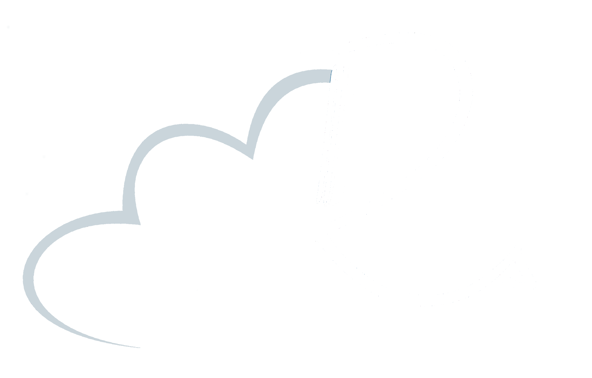

<head>
  <title>dreamRs talks</title>
</head>


```{r setup, include=FALSE}
knitr::opts_chunk$set(echo = FALSE)
library(shufflecards)
library(particlesjs)
library(phosphoricons)
library(htmltools)
source(file = "talks.R", encoding = "UTF-8")
```


```{r polyfill}
use_polyfill()
```


```{r particles}
particles(
  config = particles_config(
    particles.color.value = "#FFF", 
    particles.shape.stroke.color = "#FFF", 
    particles.line_linked.color = "#FFF"
  )
)
```


<a href="https://www.dreamrs.fr/" target = "_blank">
</img>
</a>
<h1 class="title">dreamRs talks</h1>

<p class="center">All our talks are available here</p>


<br/>

```{r sort-btn}
rmd_group_buttons(
  shuffleId = "gridapps", 
  style = "text-align: center;",
  arrange_button(label = "Name", by = "name", icon = ph("sort-asc")),
  arrange_button(label = "Date", by = "when", desc = TRUE, icon = ph("clock-clockwise")),
  arrange_button("Random!", "random2", icon = ph("shuffle"))
)
```

<br/>

```{r gridapps}
shuffle_widget(
  shuffleId = "gridapps",
  # shared_data = gapminder_shared,
  options = shuffle_options(is_centered = TRUE, gutter_width = 10),
  no_card = "No app match the filters",
  card_list = cards
)
```

